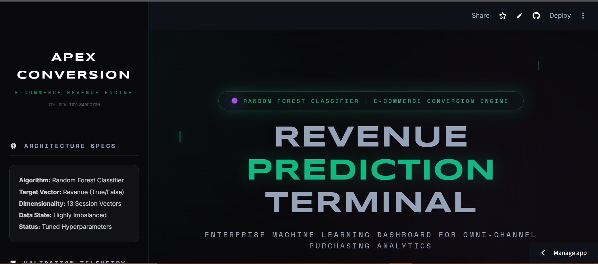
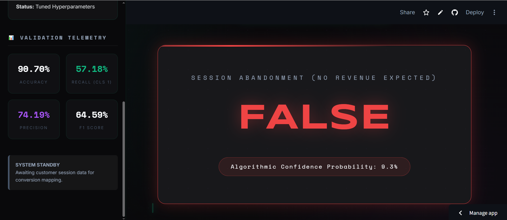
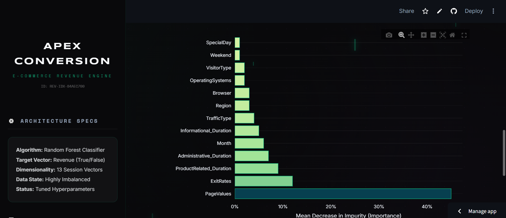

# 🛒 E-Commerce Revenue Prediction & Analytics Platform

🔗 **Live Deployment:**
https://revenue-prediction-terminal.streamlit.app/

---

#UI








# 📊 Project Overview

The **E-Commerce Revenue Prediction Engine** is an end-to-end data science platform designed to analyze user behavior during online shopping sessions and predict whether a visitor will complete a purchase.

This system integrates **Machine Learning**, **interactive analytics**, and **business intelligence dashboards** to transform raw website session data into actionable commercial insights.

The platform combines:

* **Machine Learning Prediction Engine (Python + Streamlit)**
* **Interactive Data Visualizations (Plotly)**
* **Business Intelligence Dashboard (Power BI)**
* **Session Behavior Analysis**

This architecture mirrors a real-world **data science pipeline used in modern e-commerce analytics systems**.

---

# 🧠 System Architecture

```
Website Session Data
        │
        ▼
Data Cleaning & Feature Engineering
        │
        ▼
Machine Learning Model (Random Forest)
        │
        ▼
Prediction & Probability Output
        │
        ▼
Interactive Prediction Interface (Streamlit)
        │
        ▼
Business Intelligence Dashboard (Power BI)
```

---

# 📦 Dataset Information

This dataset contains **session-level behavioral information** from an online shopping website.

The objective is to **predict whether a visitor generates revenue during a browsing session**.

### Dataset Overview

| Property        | Value                 |
| --------------- | --------------------- |
| Total Records   | 12,330                |
| Total Features  | 18                    |
| Target Variable | Revenue               |
| Problem Type    | Binary Classification |

---

# 🎯 Target Variable

**Revenue**

Indicates whether a user completed a purchase.

| Value | Meaning            |
| ----- | ------------------ |
| False | No purchase        |
| True  | Purchase completed |

### Distribution

```
False (No Purchase): 10,422
True (Purchase): 1,908
```

This indicates a **class imbalance**, which is common in real-world e-commerce data.

---

# 📑 Feature Description

## Page Interaction Features

| Feature                 | Description                            |
| ----------------------- | -------------------------------------- |
| Administrative          | Number of administrative pages visited |
| Administrative_Duration | Time spent on administrative pages     |
| Informational           | Number of informational pages visited  |
| Informational_Duration  | Time spent on informational pages      |
| ProductRelated          | Number of product pages visited        |
| ProductRelated_Duration | Time spent on product pages            |

---

## Website Behavior Metrics

| Feature     | Description                                           |
| ----------- | ----------------------------------------------------- |
| BounceRates | Percentage of visitors leaving after viewing one page |
| ExitRates   | Percentage of exits from the website                  |
| PageValues  | Average value of pages visited before purchase        |
| SpecialDay  | Closeness to special shopping days                    |

---

## Visitor & Technical Information

| Feature          | Description               |
| ---------------- | ------------------------- |
| Month            | Month of the visit        |
| OperatingSystems | Visitor operating system  |
| Browser          | Browser used              |
| Region           | Geographic region         |
| TrafficType      | Source of website traffic |

---

## Visitor Characteristics

| Feature     | Description                           |
| ----------- | ------------------------------------- |
| VisitorType | Returning or new visitor              |
| Weekend     | Whether the visit occurred on weekend |

---

# 🤖 Machine Learning Model

The system uses a **Random Forest Classifier** trained on session-level behavioral data.

The model evaluates **13 behavioral and technical features** to determine the probability that a session will lead to a purchase.

### Model Performance

| Metric                     | Score      |
| -------------------------- | ---------- |
| Accuracy                   | **90.70%** |
| Precision (Purchase Class) | **74.19%** |
| Recall (Purchase Class)    | **57.18%** |
| F1 Score                   | **64.59%** |

These metrics demonstrate strong predictive performance for a **highly imbalanced e-commerce dataset**.

---

# 📈 Power BI Analytics Dashboard

To complement the ML prediction engine, the project includes a **Power BI business intelligence dashboard** built using the model prediction dataset.

The dashboard enables interactive analysis of customer behavior and predicted purchase patterns.

### Dashboard Insights

The Power BI report includes:

**KPI Metrics**

* Total Sessions
* Total Purchases
* Conversion Rate
* Average Exit Rate

**Behavior Analysis**

* Purchases by Visitor Type
* Purchases by Traffic Source
* Monthly Purchase Trends
* Purchase vs Non-Purchase Distribution

**Interactive Filters**

* Month
* Visitor Type
* Traffic Source
* Weekend Sessions

This dashboard transforms the ML predictions into **business-ready insights for decision making**.

---

# 🧪 Advanced Analytical Modules

## 1. Shopper Intent Classification

Users input session data including:

* Session durations
* Engagement metrics
* Visitor technical profile

The system predicts **purchase probability in real time**.

---

## 2. Session Behavior Radar Mapping

Generates a **multi-dimensional radar visualization** comparing a session's engagement behavior with global averages.

---

## 3. Revenue Impact Simulator

Simulates how improvements in **user experience and product value pages** increase the probability of checkout completion.

---

## 4. Behavioral Variance Modeling

Uses **Monte Carlo simulation** to model uncertainty in online shopper behavior across multiple session scenarios.

---

## 5. Secure Data Export

Prediction results can be exported in:

* **JSON**
* **CSV**

Each prediction includes a unique **Session ID**.

---

# 🛠️ Technology Stack

### Programming & Data Processing

* Python
* pandas
* numpy

### Machine Learning

* scikit-learn
* Random Forest Classifier
* Label Encoding

### Data Visualization

* plotly.express
* plotly.graph_objects

### Application Framework

* Streamlit

### Business Intelligence

* Power BI

---

# 📂 Repository Structure

```
Revenue-Prediction-Terminal

├── app.py
├── model.pkl
├── encoder.pkl
├── requirements.txt
├── powerbi_dashboard.pbix
└── README.md
```

---

# ⚙️ Installation & Deployment

### Clone Repository

```
git clone https://github.com/akshitgajera1013/Revenue-Prediction-Terminal.git
```

### Navigate to Project

```
cd ecommerce-revenue-prediction
```

### Install Dependencies

```
pip install -r requirements.txt
```

### Run Application

```
streamlit run app.py
```

---

# ⚠️ Data Privacy Disclaimer

This system is designed strictly for **educational and analytical purposes**.

Predictions generated by the model are **probabilistic forecasts based on historical behavioral data** and should not be interpreted as guaranteed commercial outcomes.

---

# 👨‍💻 Author

**Akshit Gajera**

Data Science & Machine Learning Enthusiast
Specializing in predictive modeling, analytics dashboards, and ML-powered applications.

GitHub:
https://github.com/akshitgajera1013
